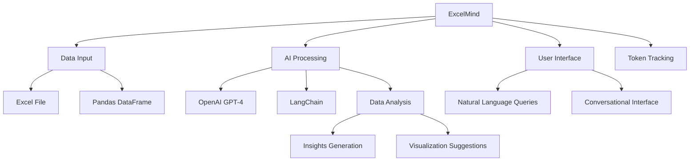

# 🤖📊 ExcelMind: AI-Powered Excel Data Analyst

ExcelMind is an intelligent assistant that helps you analyze Excel data using natural language queries. It combines the power of OpenAI's GPT-4 model with pandas data manipulation capabilities to provide insightful analysis of your Excel spreadsheets.

## 🗺️ Project Overview



## 🌟 Features

- 🗨️ Natural language interface for querying Excel data
- 📈 Powerful data analysis using pandas
- 🧠 AI-powered insights using GPT-4
- 🔢 Token usage tracking for OpenAI API
- 💬 Conversational interface for continuous interaction

## 🚀 Getting Started

### Prerequisites

- Python 3.7+
- OpenAI API key

### Installation

1. Clone the repository:
   ```
   git clone https://github.com/yourusername/excelmind.git
   cd excelmind
   ```

2. Install required packages:
   ```
   pip install pandas openpyxl langchain langchain_experimental openai tiktoken
   ```

3. Set your OpenAI API key as an environment variable:
   ```
   export OPENAI_API_KEY="your-api-key-here"
   ```

### Usage

1. Place your Excel file (e.g., 'DU Cash Card Aug.xlsx') in the project directory.

2. Run the script:
   ```
   python excelmind.py
   ```

3. Start chatting with the AI assistant about your Excel data!

## 💡 Example Queries

- "What's the total amount spent in August?"
- "Show me the top 5 categories by expenditure."
- "What was the average daily spending?"
- "Create a pie chart of expenses by category."

## 📊 Token Usage

The script tracks token usage for each interaction and the entire session, helping you monitor your OpenAI API usage.

## 🛠️ Customization

You can modify the `temperature` parameter in the `ChatOpenAI` instance to adjust the creativity of the AI responses. Higher values (e.g., 0.7) will produce more varied outputs, while lower values (e.g., 0.2) will make responses more focused and deterministic.

## 📄 License

This project is licensed under the MIT License - see the [LICENSE](LICENSE) file for details.

## 🙏 Acknowledgments

- OpenAI for the GPT-4 model
- LangChain for the excellent tools and frameworks
- Pandas developers for the powerful data manipulation library

Happy analyzing! 📊🎉
