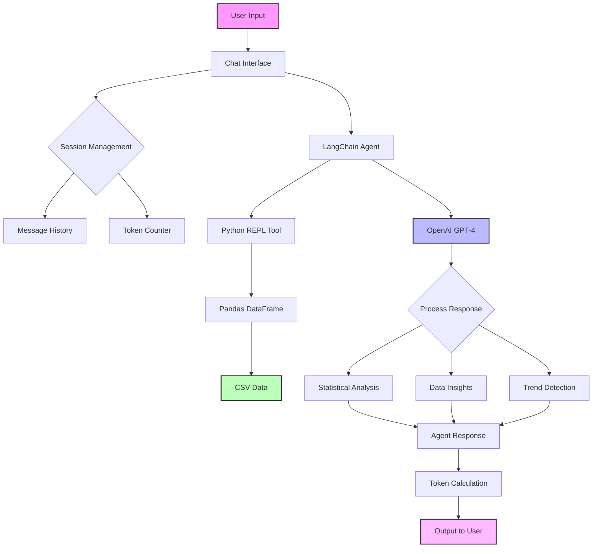

```markdown
# D.A.S.H

## Overview
An interactive chat system that leverages OpenAI's GPT-4 model to analyze retail transaction data through natural language conversations. The system combines LangChain's agent framework with pandas for powerful data analysis capabilities.

## System Architecture

```mermaid
flowchart TD
    A[User Input] --> B[Chat Interface]
    B --> C{Session Management}
    C --> D[Message History]
    C --> E[Token Counter]
    
    B --> F[LangChain Agent]
    F --> G[OpenAI GPT-4]
    F --> H[Python REPL Tool]
    
    H --> I[Pandas DataFrame]
    I --> J[CSV Data]
    
    G --> K{Process Response}
    K --> L[Statistical Analysis]
    K --> M[Data Insights]
    K --> N[Trend Detection]
    
    L --> O[Agent Response]
    M --> O
    N --> O
    
    O --> P[Token Calculation]
    P --> Q[Output to User]
    
    style A fill:#f9f,stroke:#333,stroke-width:2px
    style G fill:#bbf,stroke:#333,stroke-width:2px
    style J fill:#bfb,stroke:#333,stroke-width:2px
    style Q fill:#fbf,stroke:#333,stroke-width:2px
```

## Key Features
- Interactive chat interface for data analysis
- Context-aware conversations with message history
- Token usage tracking
- Built-in data protection and validation
- Professional data analysis capabilities

## Prerequisites
- Python 3.8+
- OpenAI API key
- Required Python packages:
  - langchain
  - pandas
  - tiktoken
  - openai

## Installation
1. Clone the repository
2. Install required packages:
```bash
pip install langchain pandas tiktoken openai
```
3. Set up your OpenAI API key
4. Place your CSV data file in the project directory

## Usage
1. Update the OpenAI API key in the code
2. Ensure your CSV file is named 'Retail_Transactions_Dataset.csv'
3. Run the main script:
```bash
python main.py
```

## Features Breakdown
1. **Data Analysis**
   - Descriptive statistics
   - Correlation analysis
   - Pattern recognition
   - Anomaly detection

2. **Conversation Management**
   - Session-based chat history
   - Context retention
   - Token usage monitoring

3. **Security**
   - API key protection
   - Data validation
   - Error handling

## System Components
1. **LangChain Integration**
   - Agent Executor
   - OpenAI Functions Agent
   - Message History Handler

2. **Data Processing**
   - Pandas DataFrame operations
   - Python REPL Tool
   - CSV data handling

3. **Chat System**
   - Session management
   - Token counting
   - Message storage

## Error Handling
The system includes comprehensive error handling for:
- API failures
- Invalid queries
- Data processing errors
- Token limit exceptions

## Contributing
Feel free to submit issues and enhancement requests.

## License
[MIT License](LICENSE)
```

Would you like me to explain any part of the flowchart or add any additional sections to the README?
