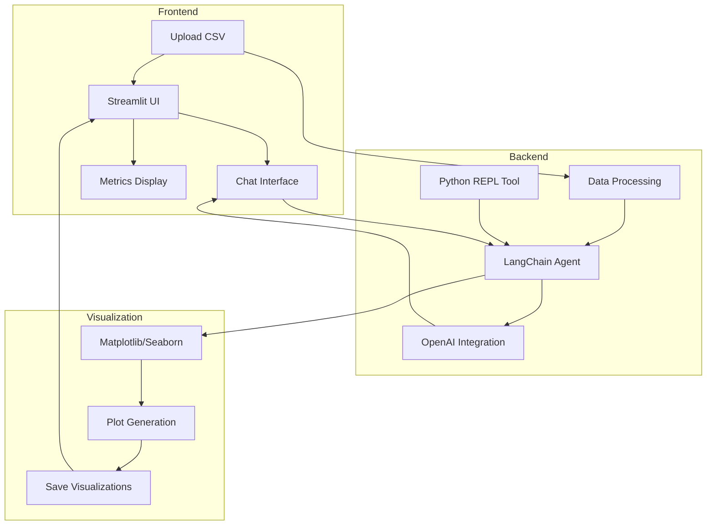

# DASH: Data Analytics & Statistical Hub

## Overview
DASH is an intelligent data analysis assistant that combines the power of large language models with advanced data visualization capabilities. It provides an interactive chat interface for analyzing CSV datasets, generating insights, and creating visualizations on demand.

## Features
- Interactive chat-based interface for data analysis
- Real-time CSV file processing and visualization
- Advanced statistical analysis using LangChain and OpenAI
- Dynamic visualization generation with Matplotlib and Seaborn
- Token usage and cost tracking
- Responsive and modern UI with custom styling
- Session-based chat history management

## System Architecture
The following flowchart illustrates DASH's system architecture and data flow:


```mermaid
flowchart TD
    subgraph Frontend
        A[Upload CSV] --> B[Streamlit UI]
        B --> C[Chat Interface]
        B --> D[Metrics Display]
    end

    subgraph Backend
        E[Data Processing] --> F[LangChain Agent]
        F --> G[OpenAI Integration]
        H[Python REPL Tool] --> F
    end

    subgraph Visualization
        I[Matplotlib/Seaborn] --> J[Plot Generation]
        J --> K[Save Visualizations]
    end

    A --> E
    C --> F
    F --> I
    K --> B
    G --> C
```

## Prerequisites
- Python 3.8+
- Streamlit
- LangChain
- OpenAI API key
- Pandas
- Matplotlib
- Seaborn
- TikToken

## Installation
1. Clone the repository:
```bash
git clone https://github.com/yourusername/dash.git
cd dash
```

2. Install required packages:
```bash
pip install -r requirements.txt
```

3. Set up your OpenAI API key:
```bash
export OPENAI_API_KEY='your-api-key-here'
```

## Usage
1. Start the application:
```bash
streamlit run app.py
```

2. Upload your CSV file using the sidebar interface
3. Start chatting with the AI to analyze your data
4. View generated visualizations and insights in real-time

## Features in Detail

### Data Analysis
- Descriptive statistics
- Correlation analysis
- Pattern identification
- Anomaly detection
- Trend analysis

### Visualization Capabilities
- Dynamic chart generation
- Multiple visualization types
- Auto-saving of generated plots
- High-resolution output

### Cost Management
- Real-time token tracking
- Cost calculation per request
- Model selection options
- Usage analytics

## User Interface
- Modern gradient-based design
- Responsive layout
- Interactive chat interface
- Real-time metrics display
- File upload management

## Security
- No data persistence
- Session-based storage
- Secure file handling
- Protected API integration

## Contributing
Contributions are welcome! Please feel free to submit a Pull Request.

## License
This project is licensed under the MIT License - see the LICENSE file for details.

## Acknowledgments
- Streamlit for the web framework
- OpenAI for the language model integration
- LangChain for the agent framework
